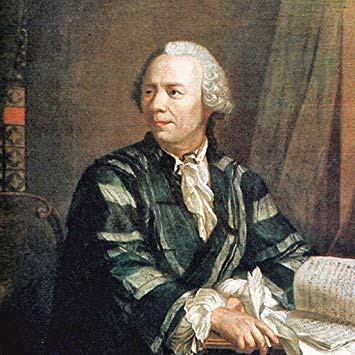

<div align="center"><h1>Project-Euler</h1></div>

This GitHub project contains simple solutions to the 20 first problems listed on Project Euler.

# Getting Started

## Prerequisites

Install Python to run all the scripts: https://www.python.org/downloads/

## Deployment

To run a python script given for level X, type the following command:

```
$ python eulerX.py
```

### Solutions

https://github.com/lukalafaye/Project-Euler/blob/master/SOLUTIONS.md

### Python

| Euler 1 	| Euler 2 	| Euler 3 	| Euler 4 	| Euler 5 	| Euler 6 	| Euler 7 	| Euler 8 	| Euler 9 	| Euler 10 	| Euler 11 	| Euler 12 	| Euler 13 	| Euler 14 	| Euler 15 	| Euler 16 	| Euler 17 	| Euler 18 	| Euler 19 	| Euler 20 	|
|---------	|---------	|---------	|---------	|---------	|---------	|---------	|---------	|---------	|----------	|----------	|----------	|----------	|----------	|----------	|----------	|----------	|----------	|----------	|----------	|
|[euler1.py](https://github.com/lukalafaye/Project-Euler/blob/master/src/euler1.py)|[euler2.py](https://github.com/lukalafaye/Project-Euler/blob/master/src/euler2.py)|[euler3.py](https://github.com/lukalafaye/Project-Euler/blob/master/src/euler3.py)|[euler4.py](https://github.com/lukalafaye/Project-Euler/blob/master/src/euler4.py)|[euler5.py](https://github.com/lukalafaye/Project-Euler/blob/master/src/euler5.py)|[euler6.py](https://github.com/lukalafaye/Project-Euler/blob/master/src/euler6.py)|[euler7.py](https://github.com/lukalafaye/Project-Euler/blob/master/src/euler7.py)|[euler8.py](https://github.com/lukalafaye/Project-Euler/blob/master/src/euler8.py)|[euler9.py](https://github.com/lukalafaye/Project-Euler/blob/master/src/euler9.py)|[euler10.py](https://github.com/lukalafaye/Project-Euler/blob/master/src/euler10.py)|[euler11.py](https://github.com/lukalafaye/Project-Euler/blob/master/src/euler11.py)|[euler12.py](https://github.com/lukalafaye/Project-Euler/blob/master/src/euler12.py)|[euler13.py](https://github.com/lukalafaye/Project-Euler/blob/master/src/euler13.py)|[euler14.py](https://github.com/lukalafaye/Project-Euler/blob/master/src/euler14.py)|[euler15.py](https://github.com/lukalafaye/Project-Euler/blob/master/src/euler15.py)|[euler16.py](https://github.com/lukalafaye/Project-Euler/blob/master/src/euler16.py)|[euler17.py](https://github.com/lukalafaye/Project-Euler/blob/master/src/euler17.py)|[euler18.py](https://github.com/lukalafaye/Project-Euler/blob/master/src/euler18.py)|[euler19.py](https://github.com/lukalafaye/Project-Euler/blob/master/src/euler19.py)|[euler20.py](https://github.com/lukalafaye/Project-Euler/blob/master/src/euler20.py)|

# Contributing

Please leave a star 🌟 and read [CONTRIBUTING.md](CONTRIBUTING.md) for details on our code of conduct, and the process for submitting pull requests to improve the project.

# Versioning

We use [SemVer](http://semver.org/) for versioning. For the versions available, see the [tags on this repository](https://github.com/lukalafaye/Project-Euler/tags). 

# Authors

* **Luka Lafaye de Micheaux** - *Initial work* - [lukalafaye](https://github.com/lukalafaye)

See also the list of [contributors](https://github.com/lukalafaye/Project-Euler/contributors) who participated in this project.

# Acknowledgments

* **Arthur Guiot** - *Added 50 solutions*  - [@arguiot](https://github.com/arguiot)
* **Mathias Lafaye de Micheaux** - *Added file links for all Python scripts* - [@mathiaslafaye](https://github.com/mathiaslafaye)

# License

This project is licensed under the MIT License - see the [LICENSE](LICENSE) file for details

---

**Copyright © 2019 Luka Lafaye de Micheaux | All Rights Reserved.**

---
